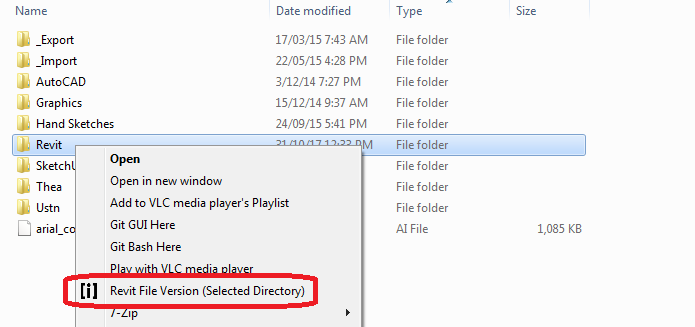
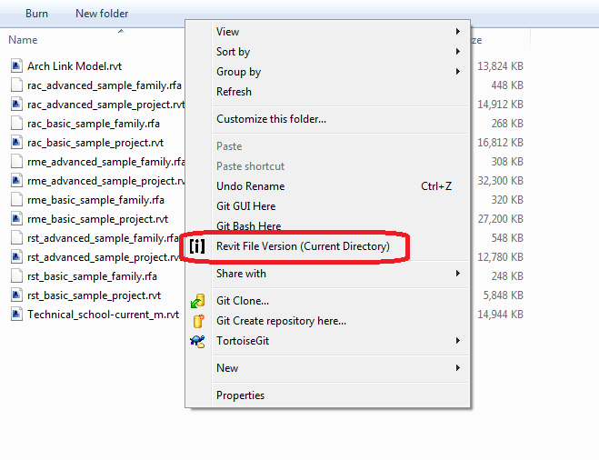

# ReVInfo #

Display Revit version information via the context menu in Windows Explorer.
ReVInfo will display information on .rvt(model) and .rfa(family) files.

ReVInfo has three modes depending on context:

1. Single file context
2. Directory context
3. Background context (for current directory.

### download ###

[Latest download](https://github.com/acnicholas/revinfo/releases/latest)

### screen shots ###

**Figure 1** Right Click on a single file to display a simple dialog

**Figure 2** Right Click on a directory to display information on Revit file in that directory.

**Figure 3** Right Click on the background to display information on Revit files in the current directory.

